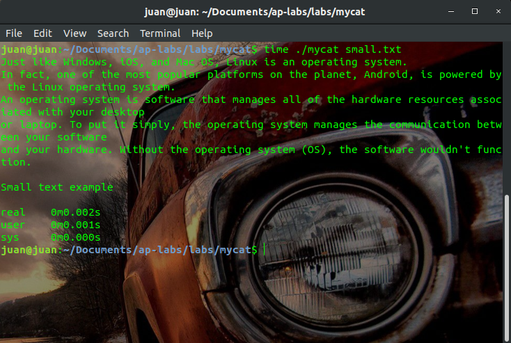
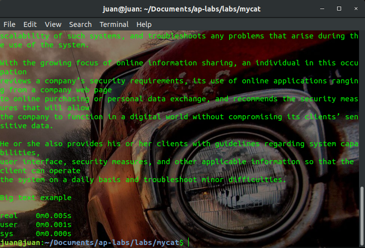
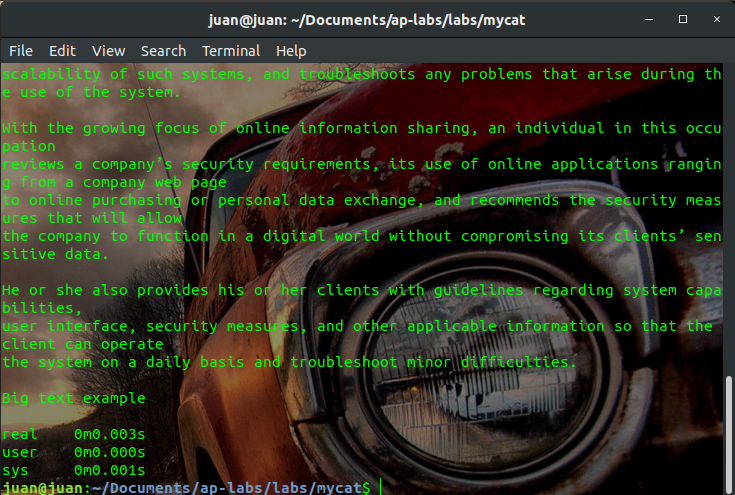

Lab - mycat
===========

Rewrite the `cat2.c` program by using `read`, `write`, `open` and `close` instead of their library equivalents.

Then, generate a report with performance metrics between the existing `cat` command  and your `mycat`.
The format of the report is free, you can add charts or whatever helps to understand the speed of both approaches.

General instructions
--------------------
1. Don't forget to do a `pull origin master` and then create the lab's branch.
2. Submit your code to your personal fork / branch.
3. Use the `cat2.c` file for your code.
4. Have fun and don't forget the [next section](#how-to-submit-your-work).

Report
------
Cat command allows us to create single or multiple files, view contain of file, concatenate files and
redirect output in terminal or files.

My cat command only supports view contain.
Using the command Time to measure the execution time of cat and mycat.
These are the results:

-> Small Text:

  - Small text Cat:


  - Small text MyCat:



-> Big Text:

  - Big text Cat



  - Big text MyCat



For conclusion my solution is faster with small text than the original cat, but with large files the original cat is faster. Because my implementation is basic compare with the original.

How to submit your work
=======================
```
GITHUB_USER=<your_github_user>  make submit
```
More details at: [Classify API](../../classify.md)
